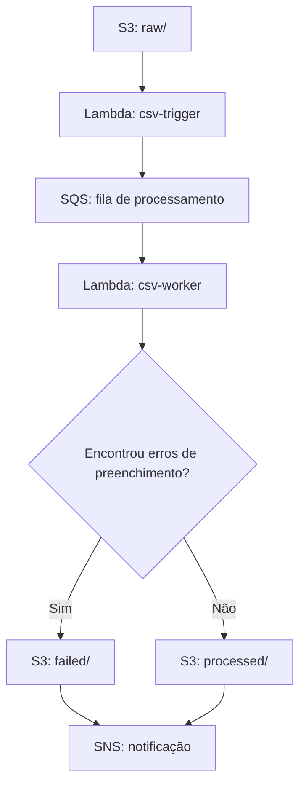

# AWS Data Pipeline — Validação automatizada de arquivos CSV

Pipeline orientado a eventos que integra **Amazon S3, AWS Lambda, Amazon SQS e Amazon SNS** para receber arquivos CSV, aplicar verificações básicas de preenchimento e separar os arquivos conforme o resultado.

Projeto de portfólio desenvolvido em **Python com Boto3**, com foco em integração de serviços AWS, processamento assíncrono e tratamento de arquivos.

## Problema de negócio

Arquivos recebidos de diferentes fontes podem conter campos sem preenchimento ou não apresentar registros de dados. Conferir cada arquivo manualmente adiciona trabalho operacional e dificulta a identificação de problemas antes do consumo por relatórios e análises.

A proposta deste projeto é automatizar essa primeira triagem: receber o arquivo, executar verificações, armazenar o resultado em um destino específico e publicar uma notificação.

## Arquitetura



A fila desacopla a recepção do evento do processamento do CSV. Uma **Dead Letter Queue (DLQ)** pode ser associada à fila principal para receber mensagens com falhas técnicas persistentes; essa associação depende da configuração da infraestrutura.

## Como funciona

1. Um arquivo é enviado ao prefixo `raw/` do bucket.
2. A Lambda `csv-trigger` extrai o bucket, a chave do objeto e o tamanho informado no evento do S3.
3. O trigger envia esses metadados como JSON para o SQS.
4. A Lambda `csv-worker` lê as mensagens e baixa o conteúdo do objeto.
5. O CSV é interpretado com `csv.DictReader` e submetido às verificações implementadas.
6. O arquivo é copiado para `processed/` ou `failed/`, e o objeto de origem é excluído.
7. O worker publica o resultado no SNS. O recebimento por e-mail exige uma assinatura confirmada no tópico.

**A classificação como válido significa somente que o arquivo passou nas regras implementadas. Ela não garante a correção dos dados de negócio.**

## Tecnologias

| Tecnologia | Papel no projeto |
|---|---|
| Python | Implementação das funções de ingestão e processamento |
| Boto3 | Integração com as APIs do S3, SQS e SNS |
| Amazon S3 | Armazenamento de entrada e dos arquivos classificados |
| AWS Lambda | Execução das funções a partir de eventos |
| Amazon SQS | Transporte assíncrono das mensagens de processamento |
| Amazon SNS | Publicação das notificações de resultado |
| Amazon CloudWatch Logs | Consulta dos logs das funções, mediante configuração e permissões |
| AWS IAM | Controle de acesso das funções aos recursos |

## Validações implementadas

| Verificação | Comportamento atual |
|---|---|
| Ausência de registros | Registra erro quando a leitura não retorna nenhuma linha de dados |
| Campos ausentes em uma linha | Registra erro para valores ausentes nas colunas interpretadas pelo leitor |
| Campos vazios ou contendo apenas espaços | Registra erro após verificar o conteúdo com `strip()` |

O código utiliza os cabeçalhos encontrados no próprio arquivo. **Ainda não há validação de um esquema obrigatório, de tipos de dados ou de regras como intervalos numéricos e unicidade.** Linhas completamente em branco podem ser ignoradas pelo leitor CSV; a implementação não realiza uma inspeção de cada linha física do arquivo.

Não foi estabelecido um percentual de acurácia ou de cobertura de erros. Para medir esses indicadores, seria necessário definir um conjunto de avaliação, os tipos de erro esperados e os resultados obtidos.

## Organização do projeto

Os componentes principais são:

- `src/csv_trigger/lambda_function.py`: recebe o evento do S3 e publica a mensagem no SQS.
- `src/csv_worker/lambda_function.py`: lê o arquivo, executa as verificações, define o destino e publica a notificação.
- `data/valido.csv` e `data/invalido.csv`: exemplos de entrada para demonstração.
- `.gitignore`: exclusão de ambientes Python, caches, arquivos `.env`, configurações locais e pacotes ZIP.

## Configuração e execução

### Pré-requisitos

- Conta AWS e permissões para configurar os serviços envolvidos.
- Bucket S3, fila SQS e tópico SNS.
- Duas funções Lambda com runtime Python compatível com o código e Boto3 disponível.
- Assinatura de e-mail confirmada no SNS, caso esse seja o canal escolhido.

### Etapas

1. Crie o bucket e utilize os prefixos `raw/`, `processed/` e `failed/` para organizar os objetos.
2. Crie a fila SQS de processamento. Caso utilize DLQ, configure a política de redirecionamento e o número máximo de recebimentos na fila principal.
3. Crie o tópico SNS e confirme a assinatura de e-mail.
4. Publique o código do trigger em uma função Lambda e o código do worker em outra. Configure o handler de ambas como `lambda_function.lambda_handler`, se mantidos esses nomes de arquivo e função.
5. Substitua `QUEUE_URL` no trigger pela URL da fila e `SNS_TOPIC_ARN` no worker pelo ARN do tópico. Na versão atual, esses valores são constantes no código.
6. Configure um evento de criação de objeto do S3 para acionar o trigger, com prefixo `raw/` e sufixo `.csv`. Esse filtro evita que as cópias em `processed/` e `failed/` iniciem outro processamento.
7. Associe a fila SQS ao worker por meio do mapeamento de origem de eventos da Lambda. Para uma demonstração inicial, use tamanho de lote igual a 1; isso reduz o impacto de falhas entre mensagens, mas não resolve duplicidades.
8. Configure permissões IAM, timeout das funções e tempo de visibilidade da fila de acordo com a documentação da AWS e o tempo de processamento esperado.
9. Envie os exemplos para `raw/` e confira o destino, os logs e a notificação.

### Permissões a configurar

| Componente | Acessos necessários ao fluxo |
|---|---|
| Trigger | Enviar mensagens à fila específica e gravar logs |
| Worker | Ler os objetos de entrada, gravar cópias nos destinos, excluir a origem e publicar no tópico SNS |
| Integração SQS–Lambda | Receber e excluir mensagens, além de consultar os atributos da fila |
| Invocação pelo S3 | Permitir que o bucket configurado invoque a função trigger |

Restrinja as políticas aos recursos e prefixos utilizados. Recursos criptografados com chaves gerenciadas pelo cliente podem exigir permissões adicionais. O código Python, isoladamente, não comprova a configuração das políticas IAM.

## Exemplos de entrada e resultado esperado

### Arquivo com campos preenchidos

```csv
nome,idade,cidade
Maria,30,São Paulo
João,25,Rio de Janeiro
Ana,28,Curitiba
```

**Resultado esperado:** cópia em `processed/`, exclusão da origem e publicação de notificação de sucesso.

### Arquivo com campos vazios

```csv
nome,idade,cidade
Maria,30,São Paulo
,,
Pedro,,Curitiba
```

**Resultado esperado:** cópia em `failed/`, exclusão da origem e publicação de notificação com os erros identificados.

### Limite da validação atual

```csv
nome,idade,cidade
Maria,abc,São Paulo
```

Esse arquivo passa nas verificações atuais porque todos os campos estão preenchidos. Validar se `idade` é um número é uma melhoria prevista.

Os resultados acima descrevem o comportamento esperado do código; não representam um relatório de testes automatizados ou uma medição de desempenho.

## Tratamento de falhas

Há dois resultados distintos:

- **Erro de preenchimento:** o arquivo é direcionado a `failed/`. Se as operações de armazenamento e notificação forem concluídas, o processamento da mensagem termina normalmente.
- **Falha técnica:** erros ao acessar o S3, copiar ou excluir objetos, publicar no SNS ou interpretar uma mensagem podem interromper a execução. As novas tentativas e o eventual envio à DLQ dependem da configuração do SQS e da Lambda.

O worker atual lança uma exceção quando encontra uma falha técnica. Ele ainda não retorna falhas parciais por mensagem; em lotes com várias mensagens, uma falha pode provocar o reprocessamento de mensagens já concluídas.

## Limitações conhecidas

- **Reprocessamento:** ainda não existe controle de idempotência. Mensagens duplicadas podem tentar processar novamente um objeto já removido da origem.
- **Notificação após exclusão:** se a publicação no SNS falhar depois da cópia e exclusão, uma nova tentativa pode não encontrar o objeto original.
- **Movimentação em duas operações:** a cópia e a exclusão são chamadas separadas, sem transação conjunta.
- **Colisão de nomes:** o destino preserva apenas o nome final do arquivo; entradas em caminhos diferentes com o mesmo nome podem apontar para a mesma chave de destino.
- **Múltiplos registros do S3:** o trigger processa apenas o primeiro registro de cada evento recebido.
- **Validação estrutural:** não são verificados cabeçalhos obrigatórios, cabeçalhos duplicados, campos excedentes, tipos ou regras de negócio.
- **Memória e formato:** o conteúdo e as linhas são carregados integralmente em memória. A leitura pressupõe UTF-8 e CSV separado por vírgulas.
- **Configuração manual:** a versão apresentada depende da criação e associação dos recursos na AWS; não inclui provisionamento automatizado no fluxo descrito.

## Evoluções planejadas

- [ ] Definir um esquema de entrada e validar cabeçalhos, tipos e quantidade de campos.
- [ ] Processar todos os registros recebidos pelo trigger.
- [ ] Externalizar URL da fila e ARN do tópico para variáveis de ambiente.
- [ ] Implementar controle de processamento por objeto/versão para tolerar duplicidades.
- [ ] Separar o estado do processamento do estado da notificação.
- [ ] Implementar respostas parciais de lote e habilitar `ReportBatchItemFailures` na integração SQS–Lambda.
- [ ] Preservar a identidade dos arquivos no destino para evitar colisões.
- [ ] Adicionar testes de validação, duplicidade e falhas de integração.
- [ ] Versionar a infraestrutura e as políticas IAM com escopo restrito.

## Custos

O consumo depende da região, do volume de arquivos, das execuções das funções, das chamadas aos serviços e da retenção de logs. A elegibilidade a benefícios gratuitos varia conforme as condições da conta e as regras vigentes da AWS. **O projeto não garante custo zero.**

## Competências demonstradas

- Integração de serviços AWS com Python e Boto3.
- Separação entre recepção de eventos e processamento assíncrono.
- Leitura de CSV e verificações básicas de preenchimento.
- Organização de arquivos por resultado de processamento.
- Publicação de notificações e registro de logs operacionais.
- Identificação de limites de confiabilidade e planejamento de melhorias.

## Referências

- [Integração entre AWS Lambda e Amazon SQS](https://docs.aws.amazon.com/lambda/latest/dg/with-sqs.html)
- [Tratamento de erros e respostas parciais de lote](https://docs.aws.amazon.com/lambda/latest/dg/services-sqs-errorhandling.html)
- [Módulo csv do Python](https://docs.python.org/3/library/csv.html)

## Autor

**Alexandre Santos Rodrigues**  
[GitHub](https://github.com/AlexandreSantosRodrigues) · [LinkedIn](https://www.linkedin.com/in/alexandresantosdata/)
